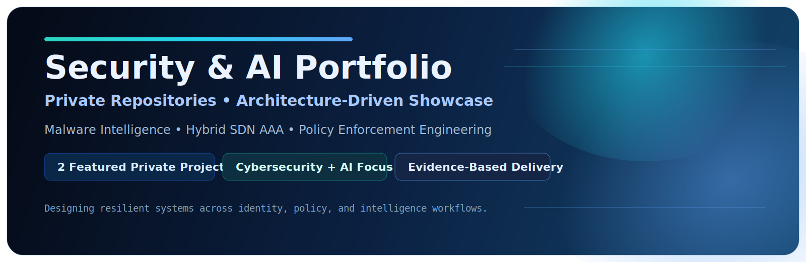
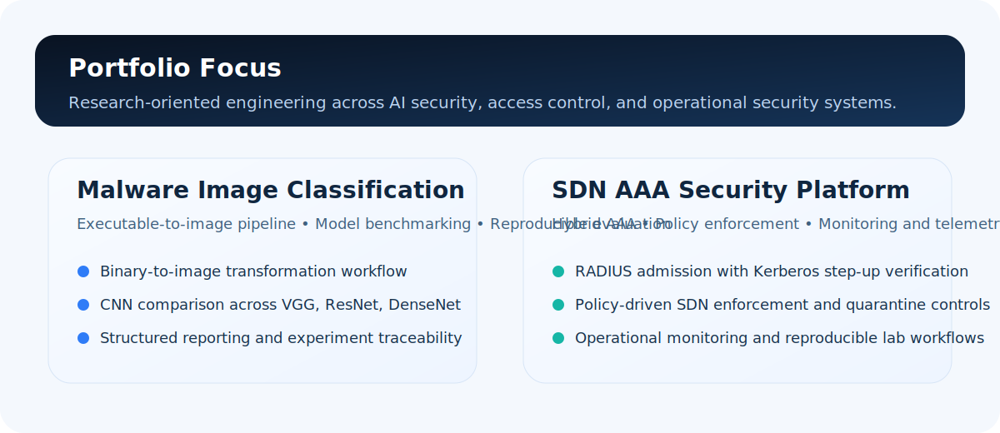

  

  <h1>Security &amp; AI Engineering Portfolio</h1>
  

    Curated technical work in <b>AI security</b>, <b>network access control</b>, and <b>research-oriented engineering</b>.
  

  

    
    
    
    
  

  This repository presents selected projects with an emphasis on <b>technical depth</b>, <b>structured methodology</b>, and <b>evidence-based engineering</b>.

  <a href="#overview">Overview</a> •
  <a href="#portfolio-highlights">Highlights</a> •
  <a href="#featured-projects">Featured Projects</a> •
  <a href="#technical-strengths">Technical Strengths</a> •
  <a href="#access-and-collaboration">Access &amp; Collaboration</a>

  

## Overview

- Primary domains: **AI Security**, **Network Security**, and **Access Control**.
- Working style: **research-informed engineering** with structured pipelines and measurable outputs.
- Public-facing portfolio: **documentation-focused**, with implementation details presented selectively.

  

## Portfolio Highlights

<table>
  <tr>
    <td width="50%" valign="top">
      <h3>Malware Image Classification</h3>
      <ul>
        <li>Executable-to-image transformation workflow</li>
        <li>Benchmarking across CNN backbones</li>
        <li>Structured experiment reporting and traceability</li>
      </ul>
    </td>
    <td width="50%" valign="top">
      <h3>SDN AAA Security Platform</h3>
      <ul>
        <li>Hybrid RADIUS and Kerberos-based admission logic</li>
        <li>Policy-driven access control in SDN</li>
        <li>Operational monitoring and lab reproducibility</li>
      </ul>
    </td>
  </tr>
</table>

## Featured Projects

<table>
  <tr>
    <th align="left">Project</th>
    <th align="left">Domain</th>
    <th align="left">Technical Core</th>
    <th align="left">Artifacts</th>
  </tr>
  <tr>
    <td><b>Malware Image Classification</b></td>
    <td>AI Security</td>
    <td>Binary-to-image workflow, CNN benchmarking, reproducible evaluation</td>
    <td>Documentation, metrics summaries, technical walkthroughs</td>
  </tr>
  <tr>
    <td><b>SDN AAA Security Platform</b></td>
    <td>Network Security</td>
    <td>Hybrid AAA, policy enforcement, telemetry and monitoring</td>
    <td>Architecture notes, lab scenarios, controlled review artifacts</td>
  </tr>
</table>

### Malware Image Classification

**Problem**  
Traditional malware detection workflows often struggle with family drift, packing, and structural variation across binaries.

**Approach**
- Transform executable files into image representations.
- Perform dataset quality analysis and visual profiling.
- Benchmark multiple CNN backbones for malware-versus-benign detection.
- Standardize experiment execution and reporting for reproducibility.

**Engineering Value**
- Combines AI experimentation with maintainable project organization.
- Emphasizes traceable evaluation and evidence-focused reporting.

---

### SDN AAA Security Platform

**Problem**  
Single-layer authentication is insufficient for segmented SDN environments that require stronger identity assurance and policy-aware enforcement.

**Approach**
- Integrate RADIUS-based admission with Kerberos step-up verification.
- Enforce role, session, rate, and quarantine policies through the controller layer.
- Expose operational visibility through monitoring and dashboard-oriented components.
- Structure experiments as repeatable lab workflows.

**Engineering Value**
- Demonstrates multi-layer security architecture thinking.
- Connects identity workflows, controller logic, and operational observability.

## Technical Strengths

| Capability | Demonstrated In |
|---|---|
| Secure system design | SDN AAA Security Platform |
| Policy-driven enforcement | SDN AAA Security Platform |
| Reproducible ML experimentation | Malware Image Classification |
| Evaluation and evidence reporting | Both projects |
| Structured technical presentation | Both projects |

## Access and Collaboration

This repository is intentionally documentation-focused.

For technical interviews, architecture walkthroughs, or controlled review sessions:
- Selected project internals can be presented live.
- Design decisions and tradeoffs can be discussed in depth.
- Supporting implementation excerpts can be shared selectively.

## Scope Statement

This public portfolio excludes:
- private source code
- secrets and credentials
- sensitive infrastructure artifacts
