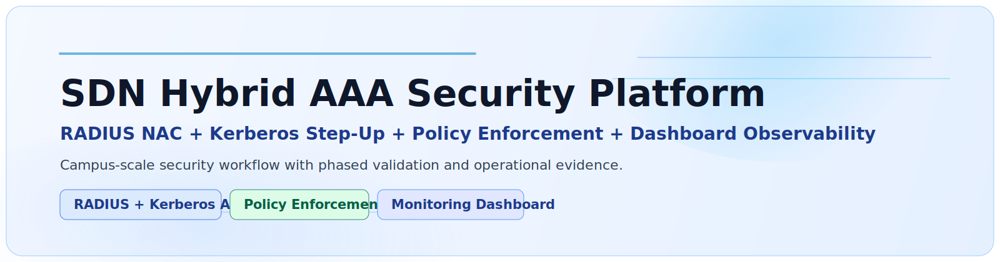
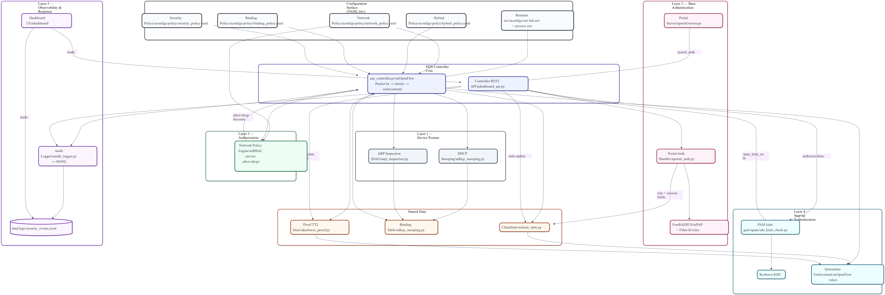
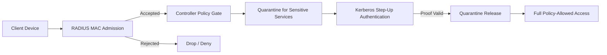
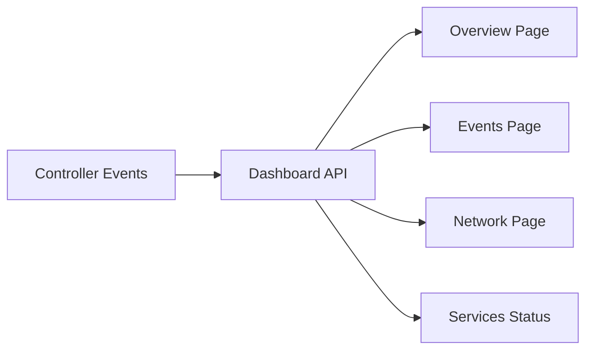
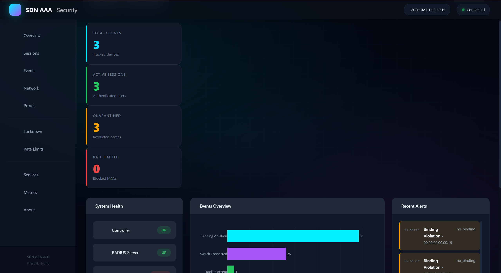
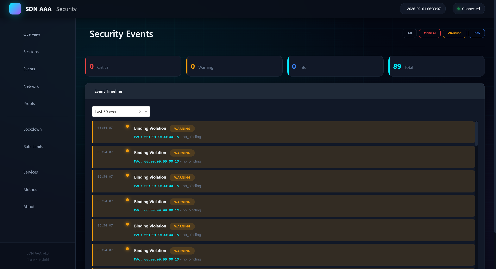
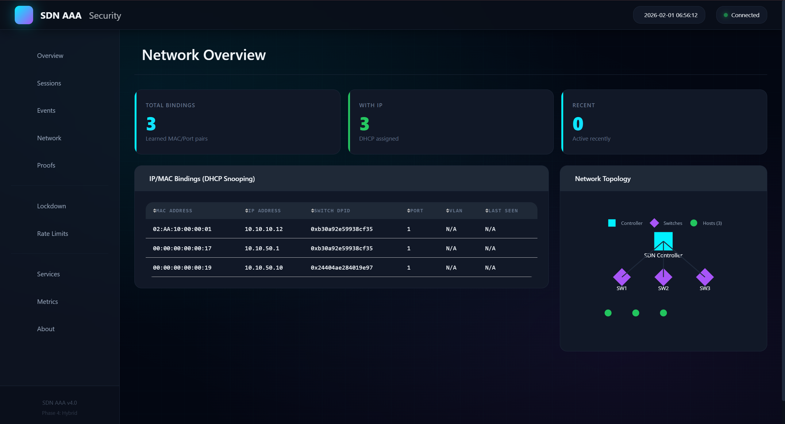
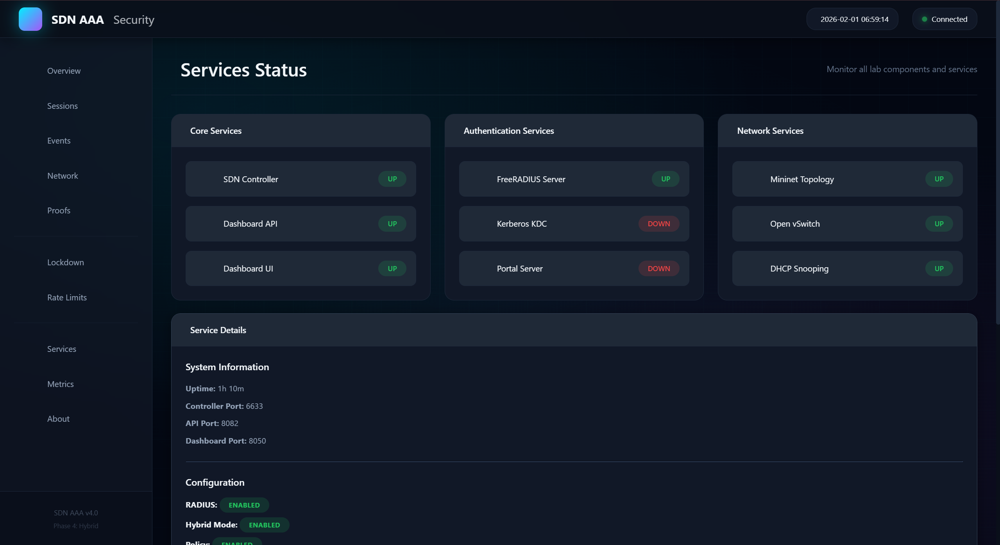

<div align="center">
  <picture>
    <source media="(prefers-color-scheme: dark)" srcset="docs/assets/visuals/banner-sdn-dark.svg">
    <source media="(prefers-color-scheme: light)" srcset="docs/assets/visuals/banner-sdn-light.svg">
    
  </picture>

  <p>
    
    
    
    
    
  </p>
</div>

<p align="center">
  <a href="#overview">Overview</a> •
  <a href="#highlights">Highlights</a> •
  <a href="#architecture">Architecture</a> •
  <a href="#workflow">Workflow</a> •
  <a href="#results-evidence">Results</a> •
  <a href="#usage">Usage</a> •
  <a href="#access">Access</a>
</p>


## Overview

This project implements a layered SDN security model for campus-style networks:
- RADIUS NAC for device admission
- Kerberos step-up for sensitive-service access
- Controller-side policy enforcement for runtime decisions
- Dashboard/API observability for operational validation

## Highlights

<table>
  <thead>
    <tr>
      <th>Dimension</th>
      <th>Implemented Value</th>
    </tr>
  </thead>
  <tbody>
    <tr>
      <td><strong>Identity & Access</strong></td>
      <td>RADIUS MAC admission + Kerberos proof + PAM-gated authorization</td>
    </tr>
    <tr>
      <td><strong>Security Controls</strong></td>
      <td>Rate limiting, session TTL, emergency lockdown, DHCP snooping, ARP inspection</td>
    </tr>
    <tr>
      <td><strong>Operational Discipline</strong></td>
      <td>Phased validation, health checks, service checks, structured release hygiene</td>
    </tr>
  </tbody>
</table>

## Architecture

<div align="center">
  
</div>

<details>
  <summary><strong>Implementation Footprint</strong></summary>

- `src/controller/aaa_controller.py` for integrated AAA and policy orchestration.
- Modular components for portal auth, Kerberos authorization, rate/session control, and L2 protections.
- Dashboard pages and API layer for runtime visibility.

</details>

## Workflow

### Hybrid AAA Control Flow



### Observability Flow



## Results Evidence

Primary artifacts:
- `data/results/latest/controller_metrics.json`
- `data/results/latest/controller.log`
- `data/results/latest/freeradius.log`
- `data/results/latest/kerberos_bootstrap.log`

### Chapter 4 UI Evidence

<div align="center">
  
  <br><br>
  
  <br><br>
  
  <br><br>
  
</div>

## Usage

```bash
make setup
make run-lab
make health
make status
make test
```

## Access

Source code is private by design.

For technical review:
- architecture walkthrough
- implementation deep dive
- controlled excerpt sharing

<p>
  <a href="mailto:your.email@example.com">
    
  </a>
</p>


