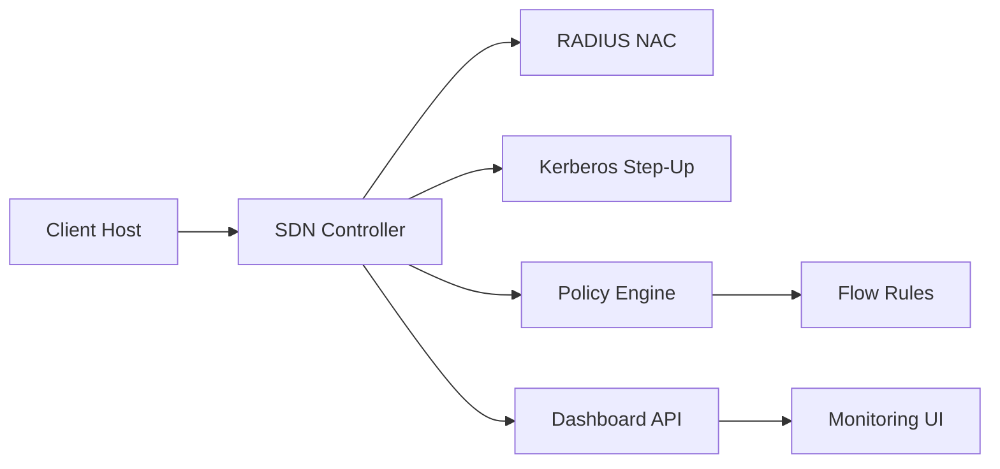

<div align="center">
  <picture>
    <source media="(prefers-color-scheme: dark)" srcset="docs/assets/visuals/banner-sdn-dark.svg">
    <source media="(prefers-color-scheme: light)" srcset="docs/assets/visuals/banner-sdn-light.svg">
    
  </picture>

  <h1>SDN Hybrid AAA Security Platform</h1>
  <p>Campus-network security architecture combining admission control, identity proof, and policy enforcement.</p>

  <p>
    
    
    
    
    
  </p>
</div>

<p align="center">
  <a href="#overview">Overview</a> •
  <a href="#implemented-work">Implemented Work</a> •
  <a href="#architecture">Architecture</a> •
  <a href="#phases--validation">Phases & Validation</a> •
  <a href="#results-evidence">Results Evidence</a> •
  <a href="#usage">Usage</a>
</p>


## Overview

This project implements a multi-layer SDN security workflow:
1. **RADIUS NAC** for initial network admission.
2. **Kerberos step-up** for stronger service-level identity proof.
3. **Policy-driven controller enforcement** for runtime access decisions.
4. **Operational observability** via API and dashboard.

The design targets realistic campus-style segmentation and repeatable security testing.

## Implemented Work

<table>
  <thead>
    <tr>
      <th>Area</th>
      <th>Delivered Components</th>
      <th>Project Paths</th>
    </tr>
  </thead>
  <tbody>
    <tr>
      <td><strong>Controller Core</strong></td>
      <td>Hybrid AAA flow orchestration, flow enforcement, policy application</td>
      <td><code>src/controller/aaa_controller.py</code></td>
    </tr>
    <tr>
      <td><strong>Authentication</strong></td>
      <td>Portal auth, RADIUS integration, Kerberos authorization checks</td>
      <td><code>src/controller/portal_auth.py</code><br><code>src/controller/kerb_authorizer.py</code></td>
    </tr>
    <tr>
      <td><strong>Security Controls</strong></td>
      <td>Rate limiter, session manager, emergency controls, L2 protection</td>
      <td><code>src/controller/rate_limiter.py</code><br><code>src/controller/session_manager.py</code><br><code>src/controller/dhcp_snooping.py</code><br><code>src/controller/arp_inspection.py</code></td>
    </tr>
    <tr>
      <td><strong>Operations Layer</strong></td>
      <td>Dashboard pages, health checks, service checks, run scripts</td>
      <td><code>dashboard/</code><br><code>scripts/</code></td>
    </tr>
    <tr>
      <td><strong>Quality & Release</strong></td>
      <td>Root `.gitignore`, secret placeholders, unit tests, structured docs</td>
      <td><code>.env.example</code><br><code>tests/</code><br><code>docs/</code></td>
    </tr>
  </tbody>
</table>

<details>
  <summary><strong>What This Shows (Expand)</strong></summary>

- Practical security engineering across controller logic, identity workflows, and runtime policy.
- Attention to release hygiene and repository quality, not only feature implementation.
- Evidence-oriented workflow with logs, metrics, and validation scripts.

</details>

## Architecture

<div align="center">
  
</div>

### Control Flow (Mermaid)



## Phases & Validation

| Phase | Focus | Validation Outcome |
|---|---|---|
| Phase 1 | Baseline topology and switching | Connectivity and controller wiring validated |
| Phase 2 | RADIUS NAC | Admit/deny path validated |
| Phase 3 | Kerberos path | Identity proof workflow validated |
| Phase 4 | Hybrid mode | Quarantine + step-up + policy flow validated |

## Results Evidence

Primary evidence artifacts:
- `data/results/latest/controller_metrics.json`
- `data/results/latest/controller.log`
- `data/results/latest/freeradius.log`
- `data/results/latest/kerberos_bootstrap.log`

Additional operational checks:
- `scripts/98_healthcheck.sh`
- `scripts/99_check_services.sh`

## Usage

### Setup
```bash
make setup
```

### Run Full Lab
```bash
make run-lab
```

### Quick Operational Checks
```bash
make health
make status
```

### Run Tests
```bash
make test
```

## Repository Structure

```text
configs/      Runtime and policy configuration
dashboard/    Monitoring UI and pages
data/         Logs and experiment outputs
docs/         Methodology, metrics, and assets
experiments/  Reproducible experiment scripts
scripts/      Lab orchestration and checks
src/          Controller and security modules
tests/        Unit and integration tests
```

## Security & Release Notes

- Sensitive values are converted to placeholders where applicable.
- Private credentials/keytabs are excluded from version control.
- Runtime artifacts and noise files are excluded via `.gitignore`.

## Scope

This repository intentionally excludes:
- private infrastructure credentials
- sensitive deployment secrets
- internal-only environment artifacts
