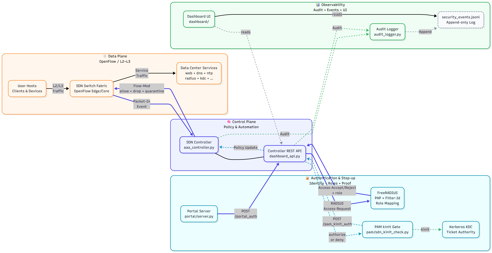
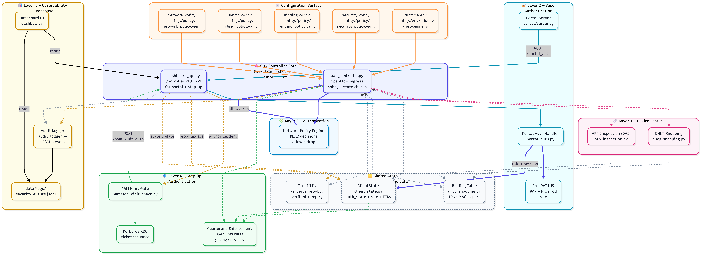
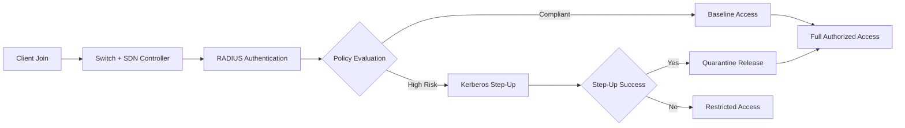
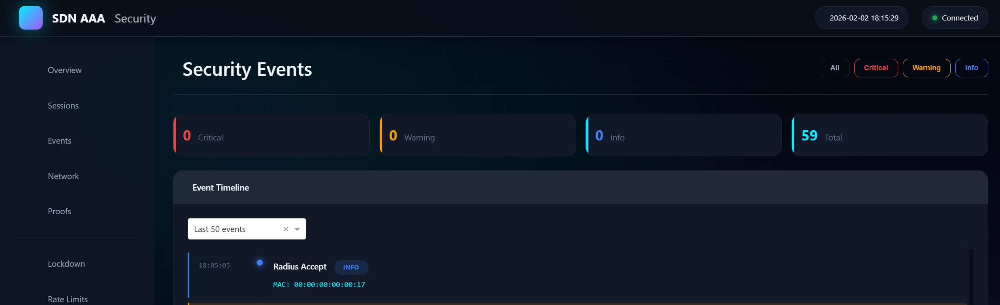
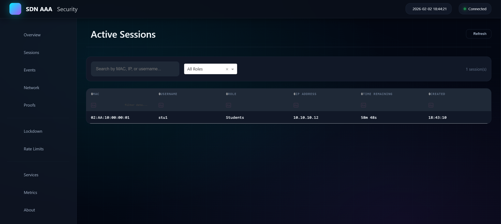
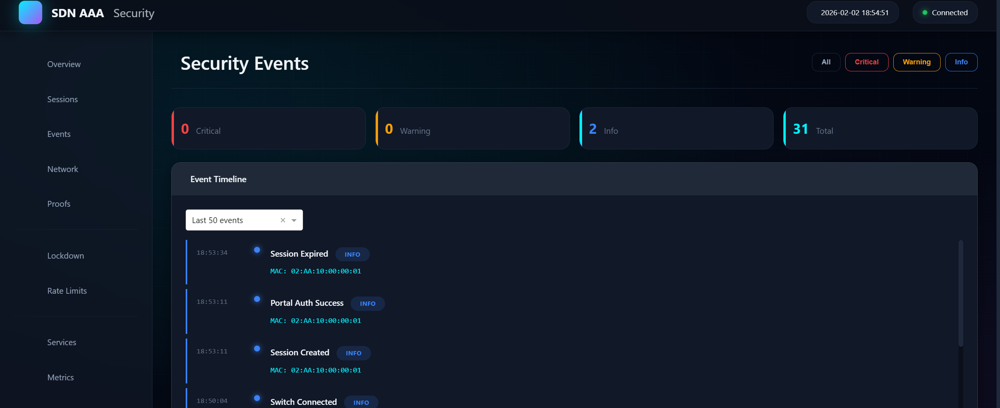
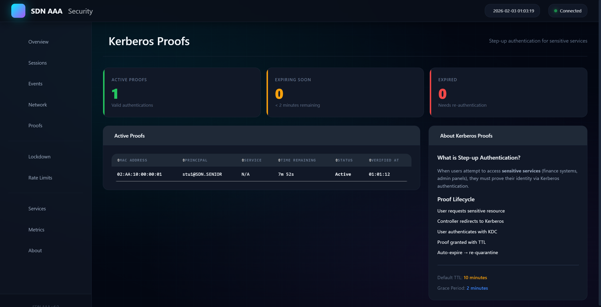
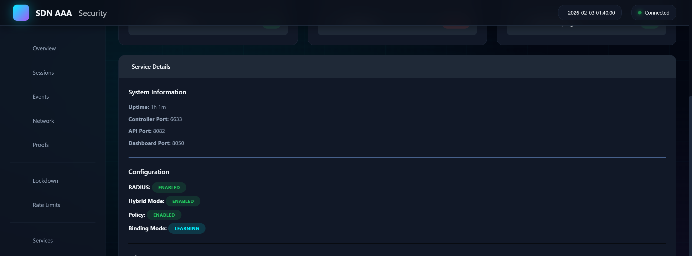

<h1 align="center">SDN Hybrid AAA Security Platform</h1>
<p align="center">RADIUS NAC + Kerberos Step-Up + Policy Enforcement + Dashboard Observability</p>

<p align="center">
  
  
  
  
  
</p>

<p align="center">
  <a href="#overview">Overview</a> •
  <a href="#architecture-evidence">Architecture</a> •
  <a href="#workflow">Workflow</a> •
  <a href="#dashboard-evidence">Dashboard Evidence</a> •
  <a href="#run">Run</a>
</p>

---

## Overview
This repository presents a portfolio-ready SDN security implementation built around hybrid AAA enforcement:
- identity-driven admission with RADIUS.
- policy gating at controller level.
- Kerberos step-up for high-risk or privileged transitions.
- observable operational state through dashboard pages and event trails.

## Architecture Evidence
<table>
  <tr>
    <td width="50%">
      
    </td>
    <td width="50%">
      
    </td>
  </tr>
  <tr>
    <td colspan="2">
      
    </td>
  </tr>
</table>

## Workflow


## Dashboard Evidence
<table>
  <tr>
    <td width="50%">
      
    </td>
    <td width="50%">
      
    </td>
  </tr>
  <tr>
    <td width="50%">
      
    </td>
    <td width="50%">
      
    </td>
  </tr>
  <tr>
    <td colspan="2">
      
    </td>
  </tr>
</table>

## Run
```bash
pip install -r requirements.txt
cp configs/env/lab.env.example configs/env/lab.env
make run-lab
```

