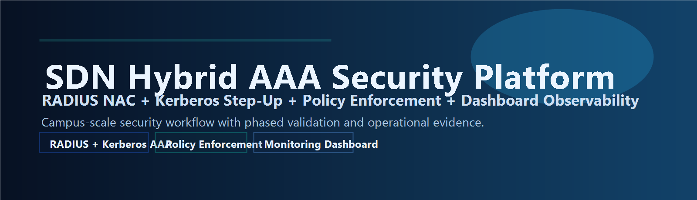
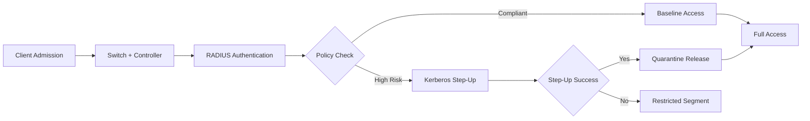
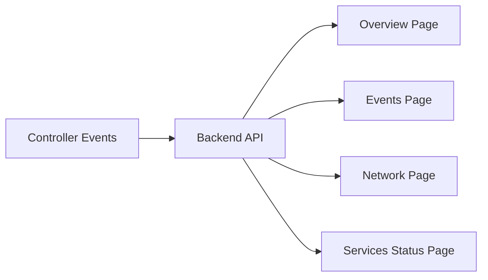
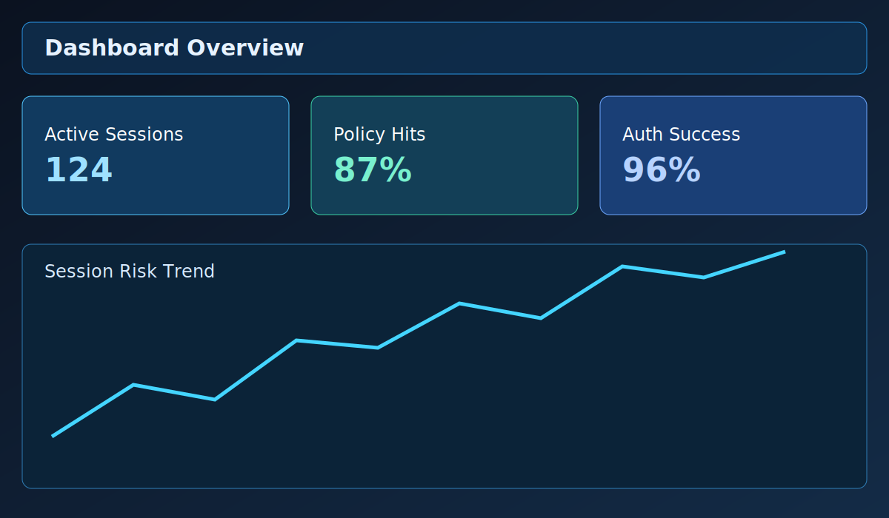
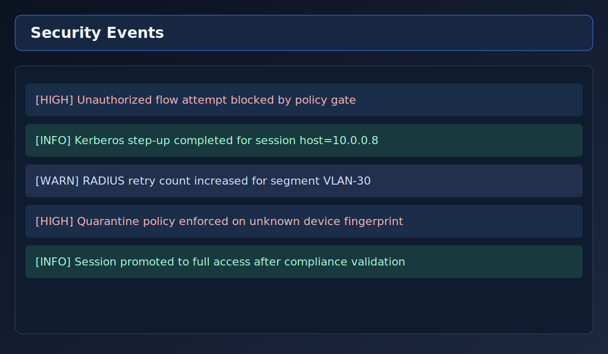
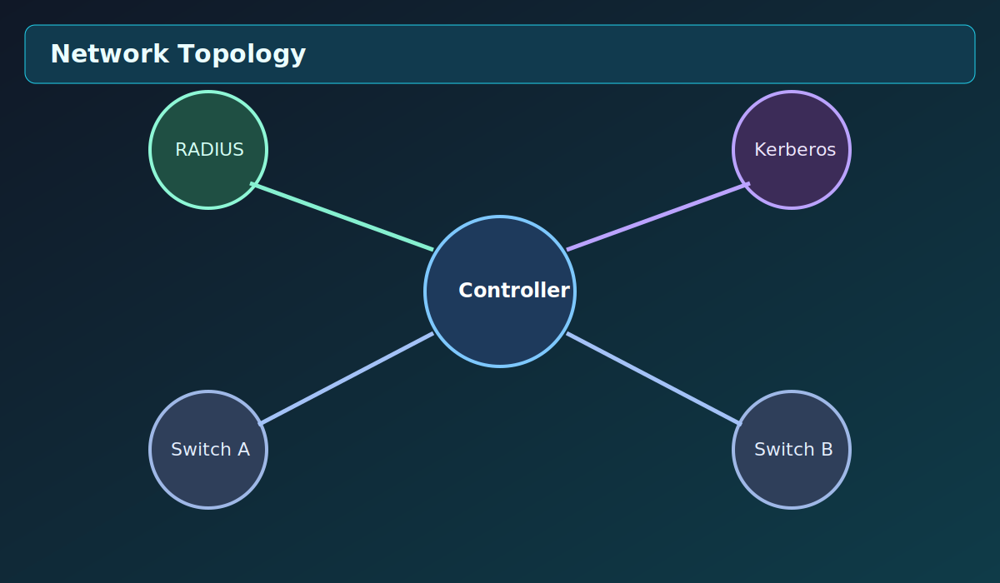
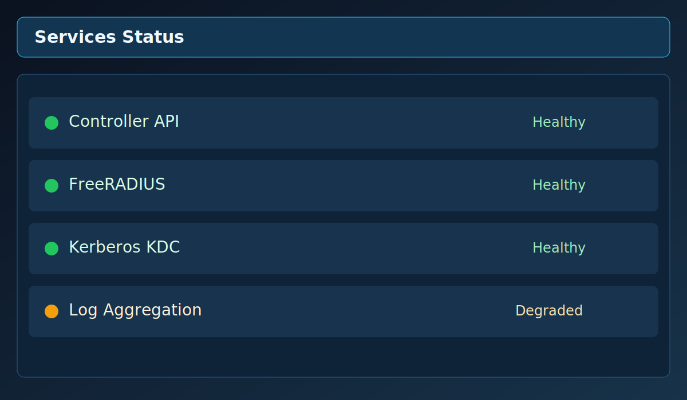

<p align="center">
  
</p>

<p align="center">
  
  
  
  
  
</p>

<p align="center">
  <a href="#overview">Overview</a> •
  <a href="#highlights">Highlights</a> •
  <a href="#architecture">Architecture</a> •
  <a href="#workflow">Workflow</a> •
  <a href="#results-evidence">Results Evidence</a> •
  <a href="#run--usage">Run / Usage</a> •
  <a href="#access">Access</a>
</p>

---

## Overview
This project implements a campus-scale SDN security platform that combines:
- Layer-2 admission control.
- RADIUS-based identity verification.
- Kerberos step-up authentication for high-risk sessions.
- Policy-driven quarantine and release logic.
- Dashboard-backed observability for operators.

## Highlights
- Multi-phase access flow from onboarding to full-trust access.
- Policy enforcement integrated with controller decisions.
- Service-state visibility for controller, RADIUS, and identity components.
- Evidence-oriented workflow with execution logs and dashboard pages.

## Architecture
<p align="center">
  
</p>

## Workflow




## Results Evidence
<table>
  <tr>
    <td></td>
    <td></td>
  </tr>
  <tr>
    <td></td>
    <td></td>
  </tr>
</table>

## Run / Usage
```bash
# 1) Install dependencies
pip install -r requirements.txt

# 2) Prepare environment variables
cp configs/env/lab.env.example configs/env/lab.env

# 3) Start the official lab entrypoint
make run-lab

# 4) Open dashboard
# http://127.0.0.1:8050
```

## Access
- Core source code remains private.
- Public repository presents architecture, execution flow, and validated evidence.

