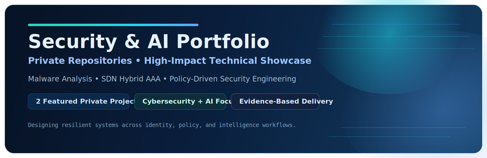



# Security & AI Engineering Portfolio

**A high-impact technical showcase of private cybersecurity and AI projects.**

> Engineering emphasis: reproducibility, policy-driven architecture, and measurable security outcomes.

## Snapshot

<table>
  <tr>
    <td><strong>Featured Projects</strong></td>
    <td><strong>Core Domains</strong></td>
    <td><strong>Delivery Style</strong></td>
  </tr>
  <tr>
    <td>2</td>
    <td>Cybersecurity + AI</td>
    <td>Architecture-first, evidence-based</td>
  </tr>
</table>

## Navigation
1. [Project Cards](#project-cards)
2. [Malware Image Classification](#malware-image-classification)
3. [SDN Hybrid AAA Security Platform](#sdn-hybrid-aaa-security-platform)
4. [Key Metrics](#key-metrics)
5. [Technical Strengths](#technical-strengths)
6. [Access and Collaboration](#access-and-collaboration)

## Project Cards

| Project | Domain | Core Contribution | Repository |
|---|---|---|---|
| **Malware Image Classification** | AI + Cybersecurity | Binary-to-image analysis pipeline with comparative deep-learning evaluation | Private |
| **SDN Hybrid AAA Security Platform** | Network Security | Multi-layer AAA enforcement (RADIUS + Kerberos) with policy controls and observability | Private |

---

## Malware Image Classification

### Problem
Conventional malware detection pipelines degrade under family variation, packing, and obfuscation. The target was a robust classifier that captures structural binary patterns through visual encoding.

### Approach
- Converted executable binaries into image representations.
- Enforced preprocessing quality controls and data consistency checks.
- Benchmarked multiple transfer-learning backbones.
- Organized the workflow into modular train/evaluate/inference stages.
- Standardized experimental output for reproducibility.

### Results
- Stable high-performance classification across selected architectures.
- Clear selection signal through comparative metrics.
- Reproducible artifacts suitable for technical and academic review.

<strong>Architecture Notes (Expand)</strong>

- Pipeline extraction from notebook-heavy origin into structured modules.
- Configuration and execution separation for consistent experiment reruns.
- Reporting workflow designed for clear model comparison and auditability.

---

## SDN Hybrid AAA Security Platform

### Problem
Single-layer authentication is inadequate for segmented SDN networks requiring identity assurance and policy-aware access control.

### Approach
- Implemented **hybrid AAA**: RADIUS NAC for admission + Kerberos step-up verification.
- Added controller-level policy enforcement for role, session, quarantine, and rate controls.
- Integrated DHCP snooping and ARP inspection for L2 trust hardening.
- Provided operational visibility via API endpoints and dashboard pages.
- Structured phased execution for repeatable security validation.

### Results
- Practical defense-in-depth architecture delivered for campus-style SDN.
- Verified progression from baseline connectivity to hybrid enforcement.
- Produced operational evidence via metrics, event logs, and service status signals.

<strong>Architecture Notes (Expand)</strong>

- Layered control model across admission, proof-of-identity, and runtime policy.
- Explicit separation between orchestration scripts and controller security logic.
- Monitoring and diagnostics treated as first-class engineering requirements.

---

## Key Metrics

| Metric | Value |
|---|---:|
| Featured Projects | 2 |
| Security Architectures Implemented | 2 |
| Core Technical Tracks | 5 |
| Reproducible Workflows | 2 |

## Technical Strengths

| Capability | Demonstrated In |
|---|---|
| Secure system architecture | SDN Hybrid AAA Security Platform |
| Policy-driven enforcement logic | SDN Hybrid AAA Security Platform |
| Reproducible ML experimentation | Malware Image Classification |
| Evidence-based evaluation and reporting | Both projects |
| Repository hardening and release readiness | Both projects |

## Access and Collaboration

Source code is intentionally private.

For technical interview review, architecture walkthrough, or controlled access requests:
- Live project walkthrough can be provided.
- Design tradeoffs and implementation rationale can be discussed in depth.
- Selected implementation excerpts can be shared upon request.

## Scope

This repository is documentation-only and intentionally excludes:
- private source code
- credentials and secrets
- restricted infrastructure artifacts
