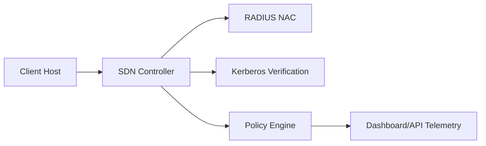



  <picture>
    <source media="(prefers-color-scheme: dark)" srcset="docs/assets/banner-dark.svg">
    <source media="(prefers-color-scheme: light)" srcset="docs/assets/banner-light.svg">
    
  </picture>

  <h1>Security &amp; AI Engineering Portfolio</h1>
  
Private repositories with public technical summaries.

  

    
    
    
  

  <a href="#overview">Overview</a> •
  <a href="#highlights">Highlights</a> •
  <a href="#architecture">Architecture</a> •
  <a href="#results">Results</a> •
  <a href="#usage">Usage</a> •
  <a href="#visual-evidence">Visual Evidence</a> •
  <a href="#access-and-collaboration">Access</a>

## Overview

This repository is a public-facing technical overview of two private projects:
- Malware Image Classification (AI + Cybersecurity)
- SDN Hybrid AAA Security Platform (Network Security)

The purpose is to present architecture, workflow, and measurable outcomes in a reviewer-friendly format.

## Highlights

<table>
  <thead>
    <tr>
      <th>Area</th>
      <th>Summary</th>
    </tr>
  </thead>
  <tbody>
    <tr>
      <td><strong>Architecture</strong></td>
      <td>Clear decomposition across data, control, policy, and evaluation layers</td>
    </tr>
    <tr>
      <td><strong>Engineering Quality</strong></td>
      <td>Reproducible workflows, release-safe structure, and consistent artifact organization</td>
    </tr>
    <tr>
      <td><strong>Security Scope</strong></td>
      <td>Hybrid AAA, policy enforcement, session/rate controls, and observability coverage</td>
    </tr>
  </tbody>
</table>

## Architecture

### Project Cards

<table>
  <thead>
    <tr>
      <th>Project</th>
      <th>Domain</th>
      <th>Core Contribution</th>
      <th>Repository</th>
    </tr>
  </thead>
  <tbody>
    <tr>
      <td><strong>Malware Image Classification</strong></td>
      <td>AI + Cybersecurity</td>
      <td>Binary-to-image pipeline with comparative deep-learning evaluation</td>
      <td><strong>Private</strong></td>
    </tr>
    <tr>
      <td><strong>SDN Hybrid AAA Security Platform</strong></td>
      <td>Network Security</td>
      <td>RADIUS + Kerberos hybrid AAA with policy enforcement and telemetry interfaces</td>
      <td><strong>Private</strong></td>
    </tr>
  </tbody>
</table>

### Visual Diagrams

  
    
  

### Mermaid View

  
<strong>Architecture Notes</strong>

- SDN project applies layered controls: admission, identity proof, and runtime policy.
- Malware project separates ingestion, preprocessing, training, evaluation, and inference.
- Both projects were organized for maintainability and clear technical review.

## Results

  

<table>
  <thead>
    <tr>
      <th>Metric</th>
      <th align="right">Value</th>
    </tr>
  </thead>
  <tbody>
    <tr>
      <td>Featured Projects</td>
      <td align="right"><strong>2</strong></td>
    </tr>
    <tr>
      <td>Security Architectures Implemented</td>
      <td align="right"><strong>2</strong></td>
    </tr>
    <tr>
      <td>Core Engineering Tracks</td>
      <td align="right"><strong>5</strong></td>
    </tr>
    <tr>
      <td>Reproducible Workflows</td>
      <td align="right"><strong>2</strong></td>
    </tr>
  </tbody>
</table>

  
<strong>Project-Specific Result Notes</strong>

**Malware Image Classification**
- Stable performance across selected architectures.
- Clear selection signal using comparative metrics.

**SDN Hybrid AAA**
- Verified baseline-to-hybrid progression.
- Operational evidence captured through metrics and event traces.

## Usage

This repository is documentation-first.

### Intended audience
- Recruiters and hiring managers
- Technical interviewers
- Security/ML reviewers

### Suggested reading path
1. Project Cards
2. Architecture diagrams
3. Results and metrics
4. Access request for deeper implementation review

## Visual Evidence

  
    
  

> Replace placeholders with real PNG/WebP screenshots exported from private projects.

## Access and Collaboration

Source code is intentionally private.

For technical review, walkthrough, or controlled access requests:
- Live architecture walkthrough is available.
- Design rationale and implementation tradeoffs can be discussed in depth.
- Selected excerpts can be shared under appropriate constraints.

  
  

## Scope

This public portfolio excludes:
- private source code
- credentials and secrets
- restricted infrastructure artifacts
