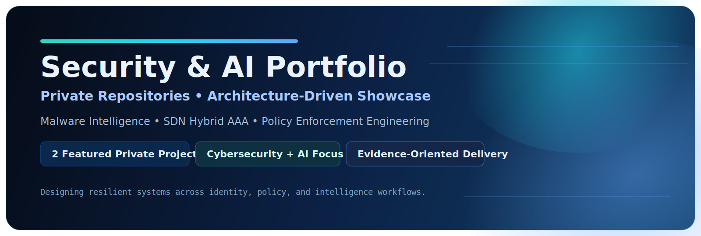
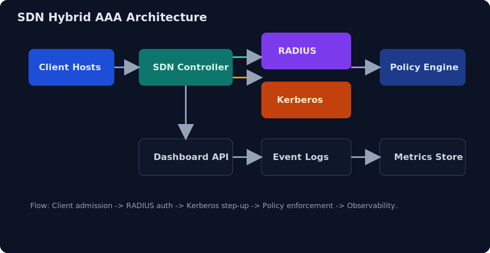
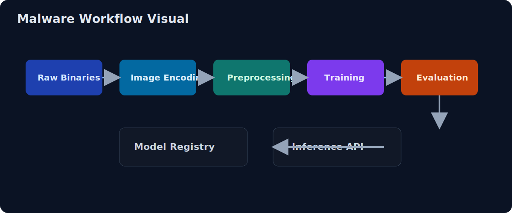
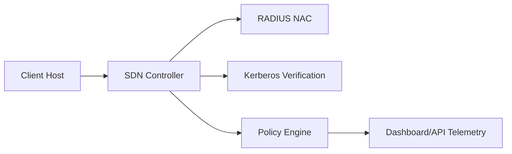
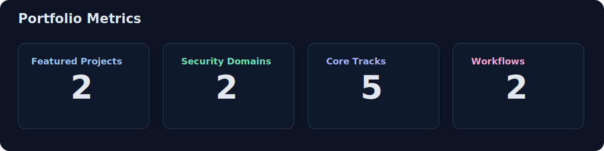
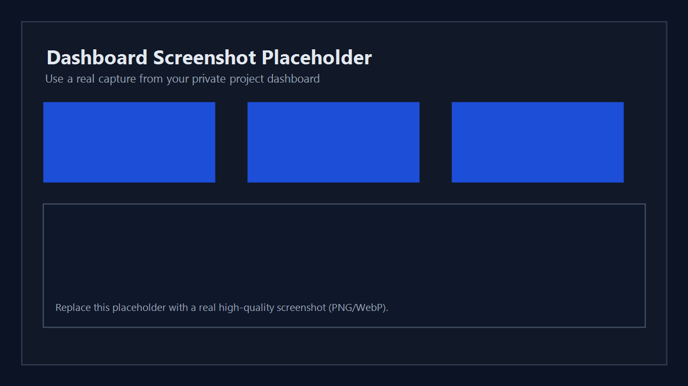
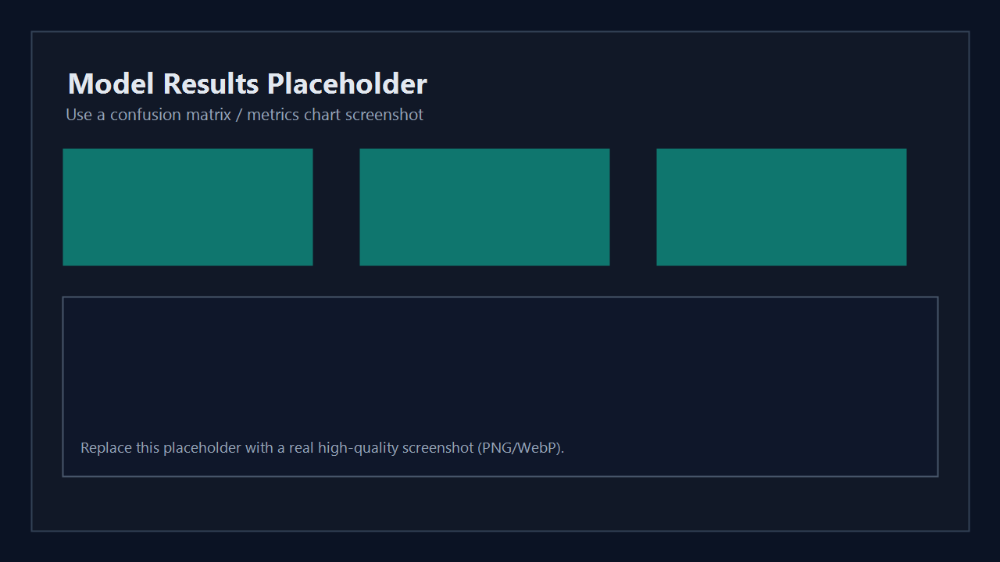



  

  <h1>Security &amp; AI Engineering Portfolio</h1>
  
<strong>Private repositories. Public technical narrative.</strong>

  

    
    
    
  

  

    
    
    
    
  

  <a href="#overview">Overview</a> •
  <a href="#highlights">Highlights</a> •
  <a href="#architecture">Architecture</a> •
  <a href="#results">Results</a> •
  <a href="#usage">Usage</a> •
  <a href="#visual-evidence">Visual Evidence</a> •
  <a href="#access-and-collaboration">Access</a>

## Overview

This repository is a **public-facing technical showcase** for two private, production-style projects:
- Malware Image Classification (AI + Cybersecurity)
- SDN Hybrid AAA Security Platform (Network Security)

The design goal is clarity for reviewers: minimal noise, high signal, and architecture-level evidence.

## Highlights

<table>
  <thead>
    <tr>
      <th>Area</th>
      <th>What Is Demonstrated</th>
    </tr>
  </thead>
  <tbody>
    <tr>
      <td><strong>Project Architecture</strong></td>
      <td>Clear decomposition of data, control, policy, and evaluation layers</td>
    </tr>
    <tr>
      <td><strong>Engineering Discipline</strong></td>
      <td>Reproducible workflow design, release-safe structure, and evidence-oriented outputs</td>
    </tr>
    <tr>
      <td><strong>Security Depth</strong></td>
      <td>Hybrid AAA, policy enforcement, session/rate controls, and observability strategy</td>
    </tr>
  </tbody>
</table>

## Architecture

### Project Cards

<table>
  <thead>
    <tr>
      <th>Project</th>
      <th>Domain</th>
      <th>Core Contribution</th>
      <th>Repository</th>
    </tr>
  </thead>
  <tbody>
    <tr>
      <td><strong>Malware Image Classification</strong></td>
      <td>AI + Cybersecurity</td>
      <td>Binary-to-image pipeline + comparative deep-learning evaluation</td>
      <td><strong>Private</strong></td>
    </tr>
    <tr>
      <td><strong>SDN Hybrid AAA Security Platform</strong></td>
      <td>Network Security</td>
      <td>RADIUS + Kerberos hybrid AAA with policy enforcement and dashboard telemetry</td>
      <td><strong>Private</strong></td>
    </tr>
  </tbody>
</table>

### Visual Diagrams

  
    
  

### Mermaid (GitHub-safe simple view)

  
<strong>Architecture Notes (Expand)</strong>

- SDN project uses layered controls: admission, identity proof, runtime policy.
- Malware project separates ingestion, preprocessing, training, evaluation, and inference.
- Both projects were hardened for maintainability and reviewer readability.

## Results

  

<table>
  <thead>
    <tr>
      <th>Metric</th>
      <th align="right">Value</th>
    </tr>
  </thead>
  <tbody>
    <tr>
      <td>Featured Projects</td>
      <td align="right"><strong>2</strong></td>
    </tr>
    <tr>
      <td>Security Architectures Implemented</td>
      <td align="right"><strong>2</strong></td>
    </tr>
    <tr>
      <td>Core Engineering Tracks</td>
      <td align="right"><strong>5</strong></td>
    </tr>
    <tr>
      <td>Reproducible Workflows</td>
      <td align="right"><strong>2</strong></td>
    </tr>
  </tbody>
</table>

  
<strong>Project-Specific Result Summaries</strong>

**Malware Image Classification**
- Stable high-performance classification across selected architectures.
- Clear model-selection signal using comparative metrics.

**SDN Hybrid AAA**
- Verified baseline-to-hybrid progression.
- Operational evidence captured through metrics, events, and service status traces.

## Usage

This repository is intentionally documentation-first.

### Intended audience
- Recruiters and hiring managers
- Technical interviewers
- Security/ML reviewers

### How to read quickly
1. Start from **Project Cards**.
2. Review **Architecture diagrams**.
3. Validate impact through **Results**.
4. Request controlled access if deeper implementation review is required.

## Visual Evidence

  
    
  

> Replace placeholders with real clean PNG/WebP screenshots from private projects.

## Access and Collaboration

Source code is intentionally private.

For technical review, walkthrough, or controlled access requests:
- Live architecture walkthrough is available.
- Design tradeoffs and implementation rationale can be discussed in depth.
- Selected excerpts can be shared under appropriate constraints.

  
  

## Scope

This public portfolio excludes:
- private source code
- credentials and secrets
- restricted infrastructure artifacts

