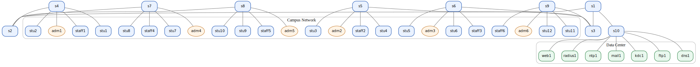
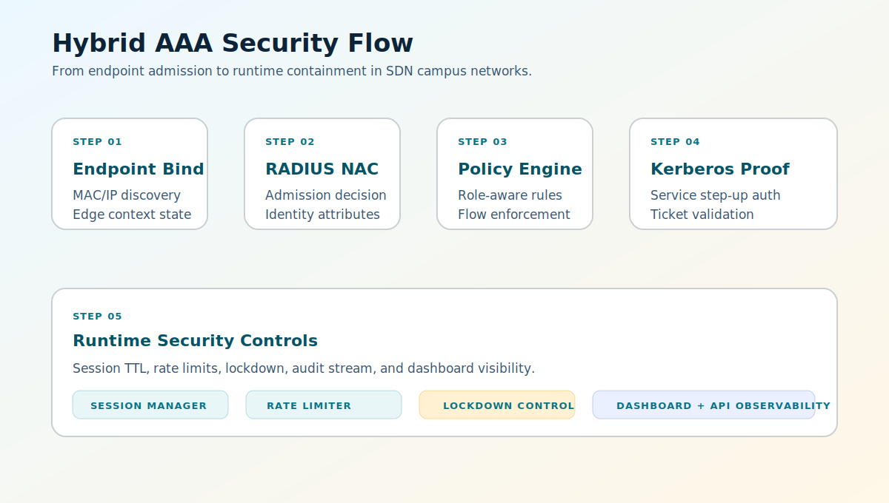

<h1 align="center">Secure SDN AAA Platform</h1>

<strong>README-First Portfolio Showcase</strong>

Hybrid identity enforcement for campus networks: RADIUS NAC + Kerberos proof + SDN policy control.

  
  
  
  

  

## Quick Navigation
- [Project Snapshot](#project-snapshot)
- [Visual Sections](#visual-sections)
- [Core Capabilities](#core-capabilities)
- [Measured Evidence](#measured-evidence)
- [Technology and Scale](#technology-and-scale)
- [Public Scope](#public-scope)

## Project Snapshot
<table>
  <tr>
    <td><strong>Tracked Files</strong> 206</td>
    <td><strong>Source LOC (Python)</strong> 8,118</td>
    <td><strong>Baseline PacketIn</strong> 6,843</td>
    <td><strong>Peak Throughput</strong> 35.1 Gbps</td>
  </tr>
</table>

## Visual Sections
<table>
  <tr>
    <td width="50%" valign="top">
      
      
<strong>Campus Topology</strong> Segmented campus-to-datacenter network layout used in experiments.

    </td>
    <td width="50%" valign="top">
      
      
<strong>Security Flow</strong> From endpoint admission to runtime containment controls.

    </td>
  </tr>
</table>

## Core Capabilities
| Capability | Enforcement Outcome |
| --- | --- |
| Hybrid AAA | RADIUS admission + Kerberos step-up for sensitive services |
| Policy-Driven SDN | Role-aware allow/deny enforcement at flow level |
| L2 Trust Controls | DHCP snooping and ARP inspection against spoofing |
| Runtime Security | Session TTL, rate limits, and emergency lockdown |
| Operational Visibility | Multi-page dashboard for services, sessions, events, metrics, and proofs |

## Measured Evidence
| Metric | Value | Source Artifact |
| --- | --- | --- |
| Baseline flow setup p95 | **0.345 ms** | `data/results/baseline/20251221T182748Z/controller_metrics.json` |
| Baseline PacketIn count | **6,843** | `data/results/baseline/20251221T182748Z/controller_metrics.json` |
| Ping loss | **0.0%** | `data/results/baseline/20251221T182748Z/metrics.json` |
| Throughput | **35.1 / 35.0 Gbps** | `data/results/baseline/20251221T182748Z/metrics.json` |

## Technology and Scale
- Stack: Python 3.10+, OS-Ken, Open vSwitch, Mininet, FreeRADIUS, Kerberos KDC, Dash/Plotly, Flask.
- Scale: 206 tracked files, 8,118 source LOC, 3,420 dashboard LOC, 2,627 scripts LOC.

## Public Scope

  
<strong>What is intentionally public in this repository?</strong>

- Architecture story and selected visual evidence.
- Quantitative metrics suitable for portfolio review.
- High-level technical framing for evaluators and recruiters.

  
<strong>What is intentionally excluded?</strong>

- Full operational implementation and internal deployment details.
- Sensitive credentials, secrets, and private environment artifacts.

## Contact for Full Implementation
Full implementation details are available upon request.
