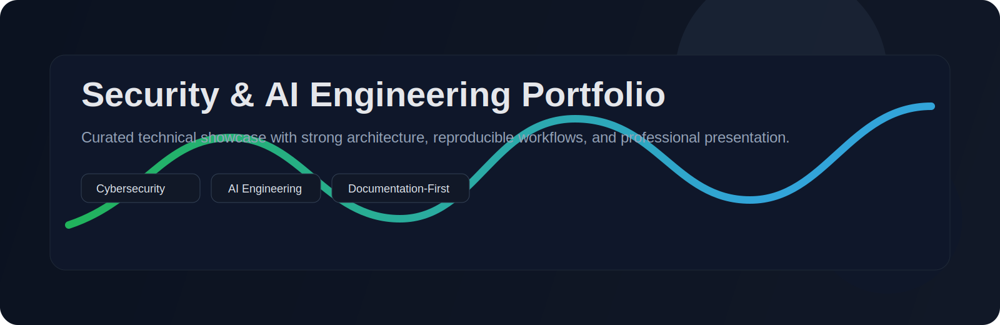
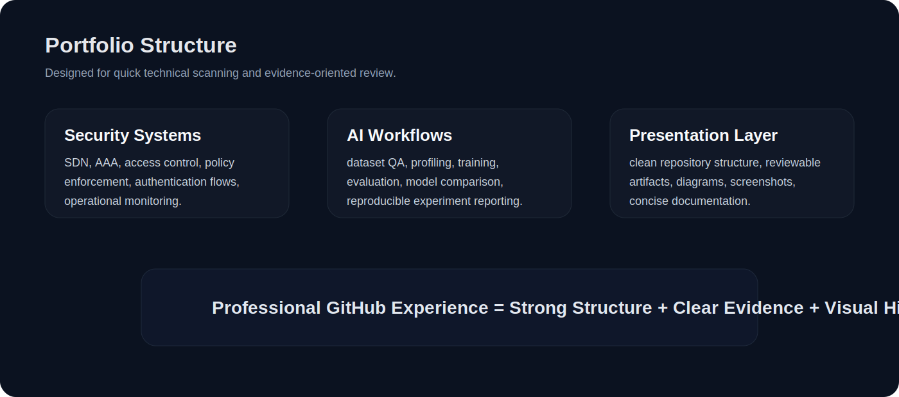
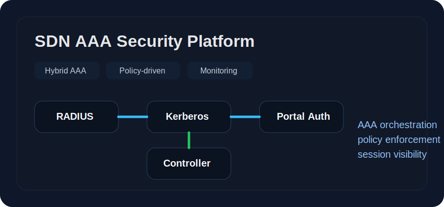
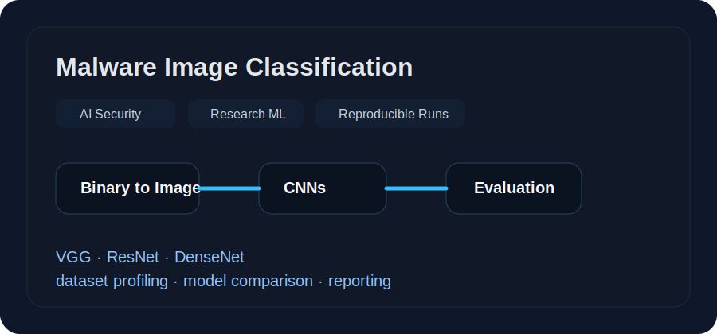
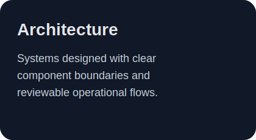
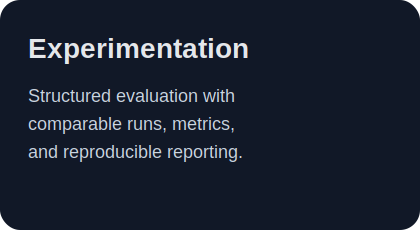
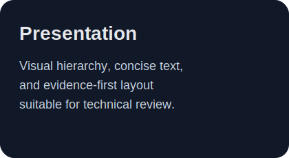

  

 

<h1 align="center">Ghena Omar-Hussain</h1>

<b>Security & AI Engineering Portfolio</b>

  Documentation-first showcase of selected cybersecurity and AI systems, focused on reproducible design, operational depth, and clean technical presentation.

  
  
  
  

---

## Overview

This repository presents selected projects across **software-defined networking security**, **hybrid AAA architectures**, and **AI-driven malware analysis**. The emphasis is on:

- technically grounded system design
- reproducible engineering workflows
- structured documentation and evidence
- professional presentation suitable for technical review

  

---

## Featured Projects

<table>
  <tr>
    <td width="50%" valign="top">
      
        
      <b>SDN AAA Security Platform</b>
       
      Policy-driven SDN security platform integrating <b>RADIUS</b>, <b>Kerberos</b>, captive portal authentication, dynamic access control, and operational monitoring through structured lab workflows.
        
      <b>Highlights</b>
      <ul>
        <li>hybrid AAA in SDN environments</li>
        <li>policy enforcement and session control</li>
        <li>dashboard-driven monitoring</li>
        <li>experimental reproducibility</li>
      </ul>
    </td>
    <td width="50%" valign="top">
      
        
      <b>Malware Image Classification</b>
       
      Research-oriented AI system that transforms executable files into image representations and benchmarks multiple CNN backbones for malware-versus-benign detection through reproducible experimentation.
        
      <b>Highlights</b>
      <ul>
        <li>binary-to-image malware representation</li>
        <li>dataset quality analysis and profiling</li>
        <li>multi-backbone evaluation</li>
        <li>structured experiment reporting</li>
      </ul>
    </td>
  </tr>
</table>

---

## Technical Strengths

<table>
  <tr>
    <td width="33%" valign="top">
      
    </td>
    <td width="33%" valign="top">
      
    </td>
    <td width="33%" valign="top">
      
    </td>
  </tr>
</table>

---

## Review Style

This portfolio is intentionally organized for **technical evaluation** rather than source-code dumping. Depending on the project, available artifacts may include:

- architecture descriptions
- workflow diagrams
- implementation summaries
- experiment outputs
- selected screenshots or evaluation figures

  
<b>Why this presentation format?</b>

   
  The goal is to present each project as a clean, reviewable engineering artifact: concise overview, strong structure, visible scope, and evidence-oriented documentation.

---

## Contact / Review

For technical walkthroughs, architecture discussions, or controlled project review sessions, this portfolio can be presented alongside selected implementation details and project artifacts.

  

